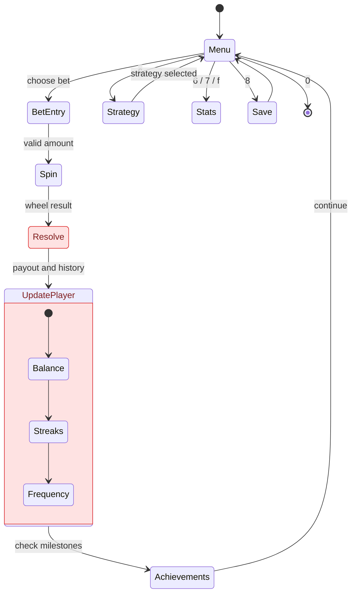

<div align="center">


</div>


## The Pitch

Most terminal games stop at a random number and a win-or-lose message. Roulette Game CLI adds the systems that make a table session interesting: multiple bet types, strategy helpers, persistent saves, achievements, hot/cold tracking, and exportable statistics.

## Feature Stack

| Area | Included |
| --- | --- |
| Bet types | Number, color, odd/even, high/low, and multiple bets |
| Strategy helpers | Martingale, Fibonacci, Conservative, and D'Alembert |
| Player state | Balance, history, win rate, streaks, best payout, worst loss |
| Persistence | Save/load game state and leaderboard support |
| Analysis | Hot/cold numbers, betting calculator, exported statistics |
| Progression | Achievement checks for milestones and standout sessions |

> Gambling systems do not change probability. Use the strategy modes as gameplay tools, not financial advice.

## Install And Play

```bash
git clone https://github.com/mertefekurt/Roulette-Game-CLI.git
cd Roulette-Game-CLI
python roulette.py
```

Optional starting balance:

```bash
ROULETTE_START_BALANCE=2500 python roulette.py
```

## Menu Keys

Press <kbd>1</kbd> through <kbd>5</kbd> for bets, <kbd>r</kbd> to repeat the previous bet, <kbd>c</kbd> to choose a strategy, and <kbd>0</kbd> to leave the table.

<details>
<summary>Full command table</summary>

| Key | Command |
| --- | --- |
| <kbd>1</kbd> | Bet on a number from 0 to 36 |
| <kbd>2</kbd> | Bet on red or black |
| <kbd>3</kbd> | Bet on odd or even |
| <kbd>4</kbd> | Bet on high or low |
| <kbd>5</kbd> | Create multiple bets for one spin |
| <kbd>6</kbd> | View statistics |
| <kbd>7</kbd> | View bet history |
| <kbd>8</kbd> | Save game |
| <kbd>9</kbd> | Load game |
| <kbd>a</kbd> | View leaderboard |
| <kbd>b</kbd> | Export statistics |
| <kbd>c</kbd> | Set betting strategy |
| <kbd>d</kbd> | View achievements |
| <kbd>e</kbd> | Open the betting calculator |
| <kbd>f</kbd> | View hot and cold numbers |

</details>

## Runtime Flow



## Project Anatomy

```text
Roulette-Game-CLI/
├── roulette.py       # Main loop, wheel logic, bet resolution
├── strategies.py     # Betting strategy implementations
├── achievements.py   # Milestone tracking
├── storage.py        # Saves, leaderboard, exports
├── calculator.py     # Payout helper
├── config.py         # Table limits and constants
└── utils.py          # Formatting helpers
```

## Table Rules

- Starting balance defaults to `$1,000`
- Minimum bet is `$10`
- Maximum bet is `$10,000`
- Number bets pay `36x`
- Even-money bets pay `2x`

## License

Released under the MIT License.
