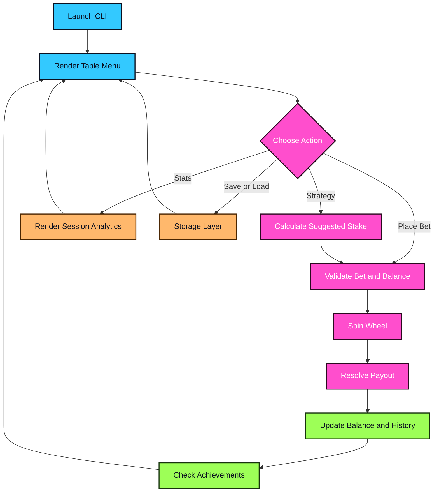

<div align="center">


</div>


Roulette Game CLI turns a simple wheel spin into a full table-session simulator with multi-bets, strategy helpers, save files, leaderboards, achievements, and exportable statistics. It is built for players, learners, and terminal enthusiasts who want a polished casino-style loop without leaving the command line.

<table>
  <tr>
    <td width="50%" valign="top">


- 🎯 Number, color, odd/even, high/low, and multi-bet modes
- 🧠 Martingale, Fibonacci, Conservative, and D'Alembert strategy helpers
- 💾 Save/load support with leaderboard persistence
- 📊 Win rate, streaks, profit/loss, best payout, and worst-loss tracking
- 🔥 Hot/cold number analytics driven by session history
- 🏆 Achievement checks for milestones and standout sessions

    </td>
    <td width="50%" valign="top">


    </td>
  </tr>
</table>





```bash
git clone https://github.com/mertefekurt/Roulette-Game-CLI.git
cd Roulette-Game-CLI
python roulette.py
```

<details>
<summary>🛠️ View CLI Reference / Advanced Config</summary>

| Key | Command |
| --- | --- |
| `1` | Bet on a number from 0 to 36 |
| `2` | Bet on red or black |
| `3` | Bet on odd or even |
| `4` | Bet on high or low |
| `5` | Build multiple bets for one spin |
| `6` | View statistics |
| `7` | View bet history |
| `8` | Save the game |
| `9` | Load the game |
| `a` | View leaderboard |
| `b` | Export statistics |
| `c` | Select a betting strategy |
| `d` | View achievements |
| `e` | Open the betting calculator |
| `f` | View hot/cold numbers |
| `r` | Repeat the previous bet |
| `0` | Exit the table |

| Setting | Default |
| --- | --- |
| Starting balance | `$1,000` |
| Minimum bet | `$10` |
| Maximum bet | `$10,000` |
| Number payout | `36x` |
| Even-money payout | `2x` |

Gambling systems do not change probability. Strategy modes are gameplay tools, not financial advice.

</details>


```text
Roulette-Game-CLI/
├── roulette.py       # Main loop, wheel logic, and bet resolution
├── strategies.py     # Strategy helper implementations
├── achievements.py   # Milestone tracking
├── storage.py        # Saves, leaderboards, and exports
├── calculator.py     # Payout helper
├── config.py         # Table limits and constants
└── utils.py          # Formatting helpers
```
